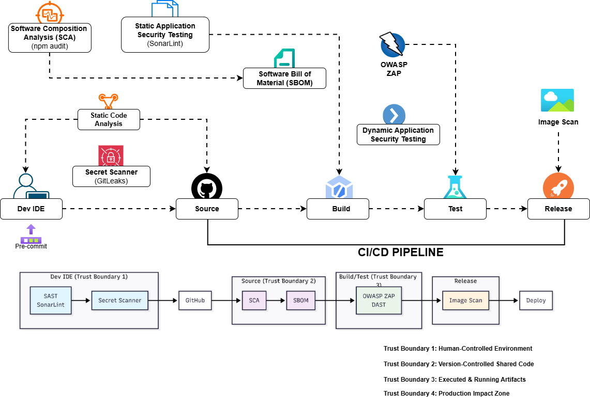

# DevSecOps Setup Documentation

## Overview

This document describes the DevSecOps pipeline implementation for the ProLink project, following industry best practices for integrating security throughout the software development lifecycle. The architecture is based on the trust boundary model, ensuring security controls are applied at each stage of the CI/CD pipeline.



## Architecture Diagram

The DevSecOps architecture diagram (`DEVSECOPS.png`) illustrates our security-first approach with four distinct trust boundaries:

1. **Trust Boundary 1**: Human-Controlled Environment (Dev IDE)
2. **Trust Boundary 2**: Version-Controlled Shared Code (Source)
3. **Trust Boundary 3**: Executed & Running Artifacts (Build/Test)
4. **Trust Boundary 4**: Production Impact Zone (Release/Deploy)

---

## Trust Boundary 1: Dev IDE (Pre-Commit)

**Status**: ⚠️ **Partially Implemented**

### Intended Implementation
- **SAST (SonarLint)**: Static code analysis in the developer's IDE
- **Secret Scanner (GitLeaks)**: Pre-commit hooks to scan for secrets before pushing code

### Current Status
- ❌ Pre-commit hooks not configured
- ❌ SonarLint integration not set up
- ❌ Local GitLeaks scanning not implemented

### Next Steps
1. Install and configure Git hooks using `pre-commit` framework
2. Set up SonarLint in developer IDEs (VS Code, IntelliJ)
3. Configure local GitLeaks scanning before commits
4. Add pre-commit validation scripts

---

## Trust Boundary 2: Source Control (GitHub)

**Status**: ✅ **Fully Implemented**

This is where most of our security controls are enforced at the pull request level.

### Implemented Security Controls

#### 1. Secret Scanning (GitLeaks)
**Workflow**: `.github/workflows/pr-secret-scan.yml`
- **Trigger**: Pull requests to `main` and `develop` branches
- **Tool**: GitLeaks v2
- **Purpose**: Detects leaked API keys, tokens, credentials, and secrets
- **Behavior**: **FAILS on any finding** - secrets are treated as critical incidents
- **Token**: Uses custom `GITLEAKS_GITHUB_TOKEN` for enhanced permissions
- **Status**: ✅ Active and working

#### 2. SAST - Static Application Security Testing (CodeQL)
**Workflow**: `.github/workflows/pr-security.yml` → `sast-codeql` job
- **Trigger**: Pull requests to `main` and `develop` branches
- **Tool**: GitHub CodeQL
- **Languages**: JavaScript (TypeScript) and Python
- **Purpose**: Analyzes source code for security vulnerabilities and insecure patterns
- **Results**: Uploaded to GitHub Security dashboard
- **Status**: ✅ Active and configured
- **Note**: Requires Code Scanning to be enabled in repository settings

#### 3. SCA - Software Composition Analysis

##### npm Audit
**Workflow**: `.github/workflows/pr-security.yml` → `sca-npm` job
- **Trigger**: Pull requests to `main` and `develop` branches
- **Tool**: `npm audit`
- **Scope**: Frontend dependencies (`./frontend`)
- **Behavior**: **FAILS on HIGH or CRITICAL** vulnerabilities
- **Status**: ✅ Active
- **Recent Fixes**: Resolved high severity vulnerabilities in `glob` and `js-yaml`

##### Python Dependency Scan
**Workflow**: `.github/workflows/pr-security.yml` → `sca-python` job
- **Trigger**: Pull requests to `main` and `develop` branches
- **Tool**: `pip-audit`
- **Scope**: Lambda function dependencies (`terraform/modules/lambda/**/requirements.txt`)
- **Behavior**: **FAILS on HIGH or CRITICAL** vulnerabilities
- **Status**: ✅ Active
- **Implementation**: Scans all `requirements.txt` files in Lambda modules

#### 4. SBOM - Software Bill of Materials
**Workflow**: `.github/workflows/pr-security.yml` → `sbom-generation` job
- **Trigger**: Pull requests to `main` and `develop` branches
- **Tool**: `@cyclonedx/cyclonedx-npm`
- **Format**: CycloneDX JSON
- **Scope**: Frontend dependencies
- **Output**: `frontend-sbom.json` (uploaded as artifact, 90-day retention)
- **Purpose**: Supply-chain visibility and incident response
- **Status**: ✅ Active

#### 5. Infrastructure Security (Terraform)
**Workflow**: `.github/workflows/pr-terraform.yml`
- **Trigger**: Pull requests affecting `terraform/**` directory
- **Tools**:
  - **Terraform Format Check**: Enforces consistent formatting
  - **Terraform Validate**: Verifies configuration correctness
  - **Terraform Plan**: Provides visibility into infrastructure changes
  - **Checkov**: Infrastructure security scanning
- **Authentication**: GitHub OIDC (no static AWS keys)
- **IAM Role**: `AWS_TERRAFORM_PLAN_ROLE_ARN` (read-only permissions)
- **Behavior**: **FAILS on HIGH or CRITICAL** Checkov findings
- **Status**: ✅ Active

### Security Gating Policy (Trust Boundary 2)

| Severity | Action |
|----------|--------|
| **CRITICAL** | ❌ **BLOCK merge** |
| **HIGH** | ❌ **BLOCK merge** |
| **MEDIUM** | ⚠️ Warning only (allows merge) |
| **LOW** | ℹ️ Log only (allows merge) |

---

## Trust Boundary 3: Build/Test

**Status**: ✅ **Partially Implemented**

### Implemented

#### 1. Build & Lint Validation
**Workflow**: `.github/workflows/main-build.yml`
- **Trigger**: Pushes to `main` branch
- **Purpose**: Validates application integrity after security approval
- **Steps**:
  - Install dependencies
  - Run ESLint (FAILS on errors)
  - Build production artifacts
  - Upload build artifacts
- **Status**: ✅ Active
- **Note**: Security scanning is NOT performed here (assumes pre-merge approval)

#### 2. DAST - Dynamic Application Security Testing
**Workflow**: `.github/workflows/main-dast.yml`
- **Trigger**: Manual workflow dispatch (staging environment only)
- **Tool**: OWASP ZAP Baseline Scan
- **Target**: Staging environment (`STAGING_URL` secret)
- **Behavior**: **FAILS on HIGH or CRITICAL** findings
- **Output**: HTML report uploaded as artifact
- **Status**: ✅ Active
- **Security**: Only allowed against staging; production scans require manual approval

### Not Yet Implemented

- ❌ Automated DAST on every build
- ❌ Integration testing with security focus
- ❌ Container image scanning (if using containers)
- ❌ Performance/load testing with security considerations

---

## Trust Boundary 4: Release/Deploy

**Status**: ❌ **Not Implemented**

### Missing Components

1. **Image Scanning**
   - Container image vulnerability scanning
   - Docker image security analysis
   - Registry scanning

2. **Release Security Checks**
   - Final security validation before deployment
   - Compliance checks
   - Security policy enforcement

3. **Deployment Security**
   - Secure deployment processes
   - Rollback procedures
   - Post-deployment verification

### Recommended Implementation

```yaml
# Future: .github/workflows/release-security.yml
- Image scanning (Trivy, Snyk, or AWS ECR scanning)
- Final security gate before production
- Deployment approval workflows
```

---

## Workflow Summary

| Workflow | Trigger | Trust Boundary | Status |
|----------|---------|----------------|--------|
| `pr-secret-scan.yml` | Pull Request | 2 (Source) | ✅ Active |
| `pr-security.yml` | Pull Request | 2 (Source) | ✅ Active |
| `pr-terraform.yml` | Pull Request (terraform/**) | 2 (Source) | ✅ Active |
| `main-build.yml` | Push to main | 3 (Build) | ✅ Active |
| `main-dast.yml` | Manual (staging) | 3 (Test) | ✅ Active |
| Pre-commit hooks | Local commit | 1 (Dev IDE) | ❌ Not implemented |
| Release security | Release | 4 (Release) | ❌ Not implemented |

---

## Security Tools & Technologies

### Currently Used

- **GitLeaks**: Secret scanning
- **CodeQL**: SAST (JavaScript, Python)
- **npm audit**: SCA for Node.js
- **pip-audit**: SCA for Python
- **CycloneDX**: SBOM generation
- **Checkov**: Infrastructure security (Terraform)
- **OWASP ZAP**: DAST scanning
- **ESLint**: Code quality and security linting

### Recommended for Future

- **SonarLint/SonarQube**: Enhanced SAST
- **Trivy**: Container image scanning
- **Snyk**: Enhanced dependency scanning
- **pre-commit**: Git hooks framework
- **Dependabot**: Automated dependency updates

---

## Configuration Requirements

### GitHub Secrets

The following secrets must be configured in the repository:

| Secret | Purpose | Workflow |
|--------|---------|----------|
| `GITLEAKS_GITHUB_TOKEN` | Custom token for GitLeaks | `pr-secret-scan.yml` |
| `TF_VAR_google_client_secret` | OAuth secret | `pr-terraform.yml` |
| `TF_VAR_linkedin_client_secret` | OAuth secret | `pr-terraform.yml` |
| `VITE_API_GATEWAY_URL` | API endpoint | `main-build.yml` |
| `STAGING_URL` | Staging environment URL | `main-dast.yml` |
| `AWS_TERRAFORM_PLAN_ROLE_ARN` | AWS IAM role for Terraform | `pr-terraform.yml` |

### GitHub Settings

- **Code Scanning**: Must be enabled for CodeQL results upload
- **Advanced CodeQL Setup**: Use `.github/workflows/pr-security.yml` as the workflow

---

## Implementation Roadmap

### Phase 1: ✅ Completed (Current)
- [x] Secret scanning (GitLeaks)
- [x] SAST (CodeQL)
- [x] SCA (npm audit, pip-audit)
- [x] SBOM generation
- [x] Infrastructure security (Checkov)
- [x] Build validation
- [x] DAST (OWASP ZAP) for staging

### Phase 2: 🔄 In Progress
- [ ] Pre-commit hooks setup
- [ ] SonarLint IDE integration
- [ ] Enhanced documentation

### Phase 3: 📋 Planned
- [ ] Container image scanning
- [ ] Release security gates
- [ ] Automated dependency updates (Dependabot)
- [ ] Security metrics dashboard
- [ ] Compliance reporting

### Phase 4: 🔮 Future Considerations
- [ ] Runtime Application Self-Protection (RASP)
- [ ] Security orchestration
- [ ] Threat modeling automation
- [ ] Security training integration

---

## Security Metrics & Reporting

### Current Metrics

- **Secret Detection**: Real-time scanning on every PR
- **Vulnerability Scanning**: Automated on every PR
- **Infrastructure Security**: Validated on Terraform changes
- **DAST**: Manual execution on staging environment

### Reporting Locations

- **GitHub Security Tab**: CodeQL findings, Dependabot alerts
- **GitHub Actions Artifacts**: SBOM, Checkov results, ZAP reports
- **PR Comments**: Terraform plan outputs

---

## Best Practices & Guidelines

### For Developers

1. **Before Committing**:
   - Run linting locally (`npm run lint`)
   - Check for secrets in code
   - Review dependency updates

2. **Pull Requests**:
   - Ensure all security checks pass
   - Address HIGH/CRITICAL findings before requesting review
   - Review Terraform plan outputs for infrastructure changes

3. **Security Findings**:
   - HIGH/CRITICAL: Must be fixed before merge
   - MEDIUM: Should be addressed in follow-up PR
   - LOW: Optional, but recommended to fix

### For Security Team

1. **Monitor**:
   - GitHub Security dashboard
   - Workflow run results
   - Artifact uploads

2. **Review**:
   - Failed security checks
   - New vulnerability reports
   - Infrastructure changes

3. **Maintain**:
   - Keep security tools updated
   - Review and update security policies
   - Update documentation

---

## Troubleshooting

### Common Issues

1. **CodeQL upload fails**: Ensure Code Scanning is enabled in repository settings
2. **GitLeaks 403/404 errors**: Verify `GITLEAKS_GITHUB_TOKEN` has correct permissions
3. **npm audit failures**: Run `npm audit fix` locally and commit updates
4. **Terraform OIDC errors**: Verify IAM role ARN is correct and trust relationship is configured

### Getting Help

- Review workflow logs in GitHub Actions
- Check security dashboard for detailed findings
- Consult this documentation
- Review tool-specific documentation

---

## References

- [GitHub Actions Documentation](https://docs.github.com/en/actions)
- [CodeQL Documentation](https://codeql.github.com/docs/)
- [GitLeaks Documentation](https://github.com/zricethezav/gitleaks)
- [OWASP ZAP Documentation](https://www.zaproxy.org/docs/)
- [Checkov Documentation](https://www.checkov.io/)
- [CycloneDX Specification](https://cyclonedx.org/)

---

## Changelog

### 2026-01-02
- ✅ Implemented comprehensive PR security workflows
- ✅ Added GitLeaks secret scanning
- ✅ Configured CodeQL for JavaScript and Python
- ✅ Set up npm and pip dependency scanning
- ✅ Implemented SBOM generation
- ✅ Added Terraform security scanning with Checkov
- ✅ Configured DAST with OWASP ZAP for staging
- ✅ Fixed high severity npm vulnerabilities
- ✅ Resolved workflow configuration issues

---

**Last Updated**: January 2, 2026  
**Maintained By**: DevSecOps Team  
**Document Version**: 1.0

